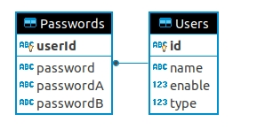

# User Type Management System

## About
This is a test application for David.

## Application features
* create user
* set user password
* change user type
* delete user
* get user by id
* get all users

## Common Technologies
* Java 11
* Spring Boot 2.1.6.RELEASE
* Maven
* Sqlite3

## Test info
* junit 4
* allure

## DB structure

## Setup
* set your credentials for sqlite in file {project}/src/main/resources/application.properties
### Nativ
* run `mvn clean install` for build application jar file
* run jar file using command `java -jar target/$(ls ./target | grep \.jar | grep -v original | grep -v javadoc | grep -v sources)`
###Docker
* run `docker build -t <name> .`. For example `docker build -t my-app .`
* run `docker run -d -p 8080:8080 <name>`. For example `docker run -d -p 8080:8080 my-app`. For more information about docker commands and params, see [Docker documentation](https://docs.docker.com/engine/reference/run/)

#### Setup Notes
If you want to skip unit tests - run `mvn clean install -DskipTests` (also change it in Dockerfile)

## Using
This application implement Rest Api. So, you can call all of them using any Rest client or curl command (Linux).

**List of API:**
Root path `/api/user/management/`
* **add-user**
* **get-user-by-id**
* **get-all-users**
* **change-user-type**
* **delete-user**
* **set-user-passwords**

### For more information about API and request/response parameter, read javadoc
* run `mvn javadoc:javadoc`
* open file (by browser) {project}/target/site/apidocs/index-all.html
* find and open link **UserManagementController**
